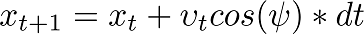
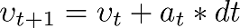

# Model Predictive Control - Project writeup
The processing pipeline consists of three primary functions:
  * Predict future vehicle state using current state and a kinematic model
  * Analyse waypoints to calculate errors in position and heading
  * Using MPC, predicted state and errors, solve for the actuation commands that cause the vehicle to follow the optimal trajectory

## Prediction
The prediction step produces an updated vehicle state by using a model that captures the kinematic nature of a dynamical vehicle system to calculate the change in the current state after some time, `dt`. The current state is passed in by the simulator.






The vehicle state is modeled using `x` and `y` coordinates, a heading `psi`, speed `v`, steering angle `d` and acceleration `a`. The prediction is calculated by passing references to the state variables to a modeling function `globalKinematic(x, y, psi, v, d, a, dt)`, which updates the state variables using the above state equations.

#### How the model copes with latency
In a real situation, an actuation command won't execute instantly. There will be a delay as the command propagates through the system. To model this real world latency, the code adds a 100_ms_ delay using `this_thread::sleep_for(chrono::milliseconds(100))`. Furthermore, the MPC stage introduces additional latency as it solves for the optimal control outputs. To factor in these latencies, the time delta is calculated by measuring system time between predictions using `std::chrono::system_clock::now()`.

## Waypoints
As well as the current state vector, the simulator also passes in a new set of reference waypoints in the map's coordinate system. The reference waypoints track the centre of the lane and are used to measure how far from the optimal driving position the vehicle is, known as the error. From these measurements, the MPC will aim to determine the level of correction needed in the actuators to reduce this error.

The waypoints are first converted from the map coordinate system to the vehicle's local coordinate system. Then, the coordinates are fitted to a third degree polynomial that describes the optimal trajectory of the vehicle. From this reference trajectory, errors in the vehicle's latitudinal position (cross track error) and in the vehicle's heading (orientation error) can be calculated, to be fed into the MPC.

## MPC
The goal of MPC is to get the vehicle to follow the optimal trajectory. Following the optimal trajectory is ultimately achieved by driving the cross track and orientation errors to zero. Finding which actuation commands cause the largest reduction in errors is known as an optimisation problem. That is, to find the maximum reduction in the errors within the physical bounds of the system, MPC tries to solve for the optimal state. These updated state variables are then used to control the vehicle's actuation.

#### Cost
An optimisation problem is implemented by defining the [cost function](https://en.wikipedia.org/wiki/Loss_function) that the optimiser will seek to minimise. [Ipopt](https://projects.coin-or.org/Ipopt) is a C++ library used in the code to optimise the control inputs. In the code blocks below, the cost function is created by feeding the relevant equations into the first element of the vector that is fed into the solver, `fg`.

The first additions to this cost function are the cross track error and orientation error equations. The reference value for an error equation is zero. Also shown in this code block is a non-zero reference speed against which the optimiser will try to maintain.
```cpp
for (unsigned int t = 0; t < N; ++t) {
  fg[0] += CppAD::pow(vars[cte_start + t], 2);
  fg[0] += CppAD::pow(vars[epsi_start + t], 2);
  fg[0] += CppAD::pow(vars[v_start + t] - ref_v, 2);
}
```

This may be enough to be "correct". But other considerations will help to make the vehicle operate in a more functional and safer way. The cost function can also be used to limit the amount of actuation sent to the vehicle. This helps to prevent, for example, sending maximal steering angles in reaction to a large cross track error, which would cause the vehicle to veer. The same limitation on acceleration is implemented.
```cpp
for (unsigned int t = 0; t < N - 1; ++t) {
  fg[0] += CppAD::pow(vars[delta_start + t], 2);
  fg[0] += CppAD::pow(vars[a_start + t], 2);
}
```

Similarly to above, limitations on the impact of high rates of change in steering and acceleration help to actuate the vehicle more smoothly over time.
```cpp
for (unsigned int t = 0; t < N - 2; ++t) {
  fg[0] += CppAD::pow(vars[delta_start + t + 1] - vars[delta_start + t], 2);
  fg[0] += CppAD::pow(vars[a_start + t + 1] - vars[a_start + t], 2);
}
```

#### Constraints
The Ipopt library also considers constraints on the solver. Adding actuator constraints is necessary to capture the physical limitations of the mechanics of actuation. For example, a steering column has a minimum and maximum turning angle providing a range of motion within which the steering command __must__ operate. It doesn't make sense for the optimiser to consider any solutions outside these bounds.

#### Prediction horizon
The prediction horizon, *T*, is the duration over which future predictions are made. This duration is set by two variables, *T* = *N* \* *dt*.

*N* is the number of timesteps in the prediction horizon that the optimiser will solve for and *dt* is the time that elapses between timesteps.

*N* will directly impact the computational cost of running the optimiser, so it helps to keep this low. *dt* will affect how frequently the vehicle is actuated, so it also helps to keep this low. However, both variables affect the duration of the prediction horizon, and a prediction horizon that is too small will risk not defining enough actuation to cope with the end-to-end latency of the vehicle system. A sensible prediction horizon is 1 to 2 seconds. Anything greater will risk not capturing changes in the state of the environment.

```cpp
size_t N = 8;
double dt = 0.1;
```
